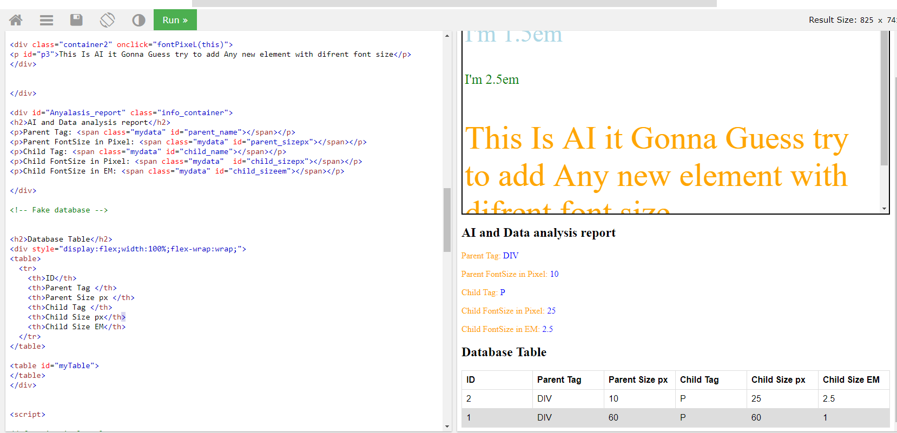

# AI_function_data_anylasis

IT can collect alot of info about the element and it's parent and finally calculte and get the font_size
of child element in em, by the way no function until now do that tell your what font size of element in EM
I think w3c must add this function or method to the core of HTML 

